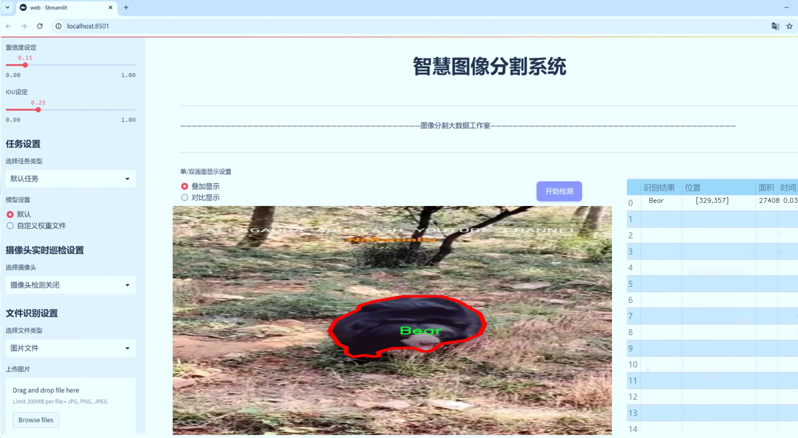
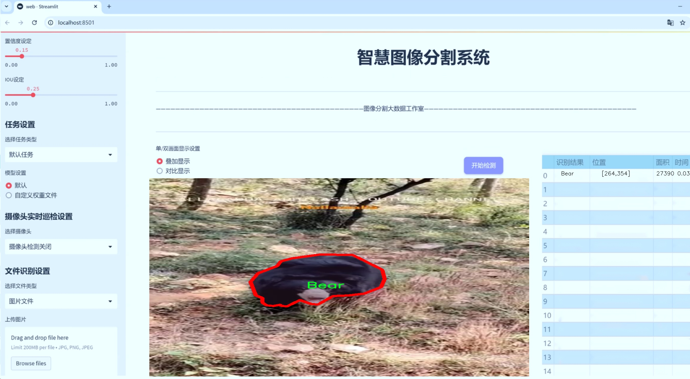
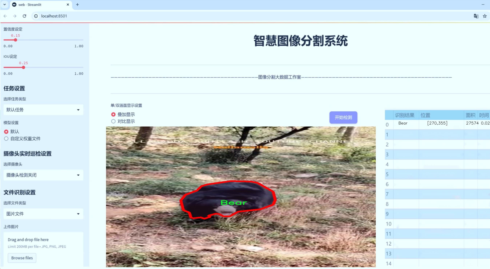
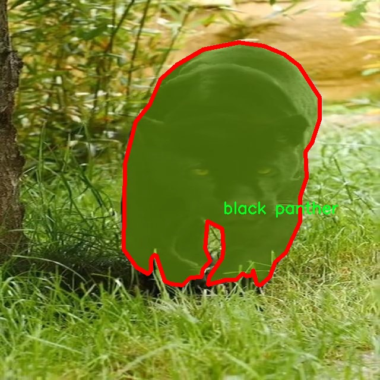
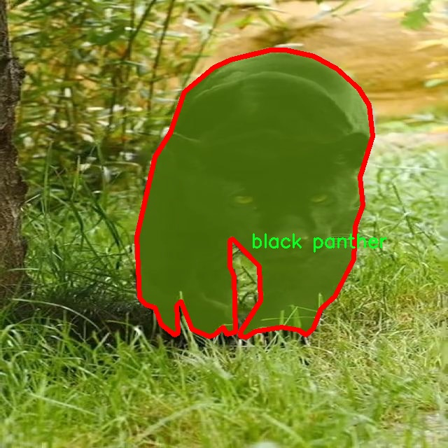
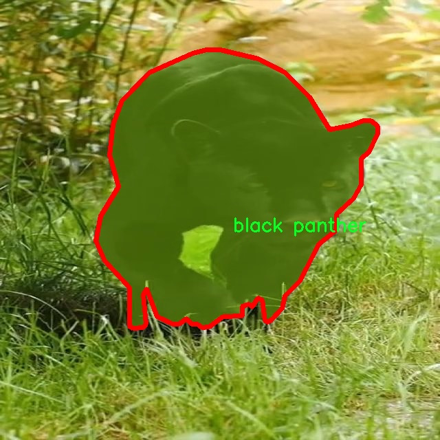
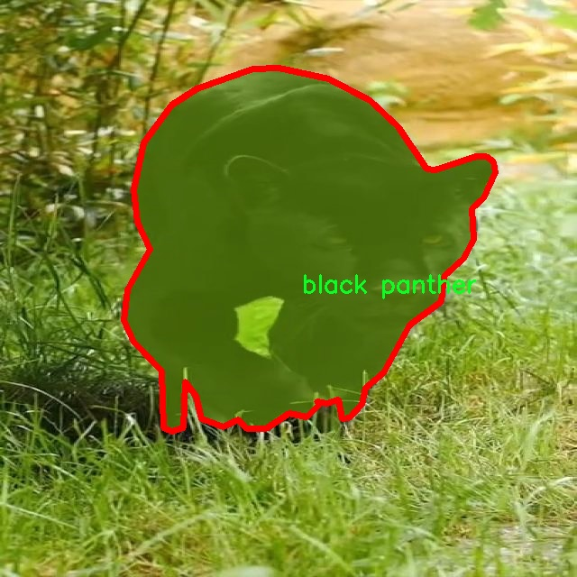
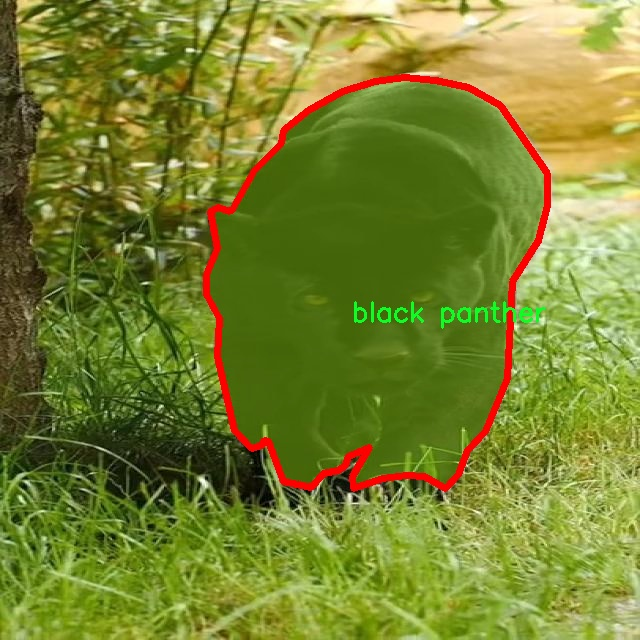

# 动物图像分割系统源码＆数据集分享
 [yolov8-seg-C2f-RFCBAMConv＆yolov8-seg-C2f-DCNV2-Dynamic等50+全套改进创新点发刊_一键训练教程_Web前端展示]

### 1.研究背景与意义

项目参考[ILSVRC ImageNet Large Scale Visual Recognition Challenge](https://gitee.com/YOLOv8_YOLOv11_Segmentation_Studio/projects)

项目来源[AAAI Global Al lnnovation Contest](https://kdocs.cn/l/cszuIiCKVNis)

研究背景与意义

随着计算机视觉技术的快速发展，动物图像分割作为一种重要的应用场景，受到了广泛的关注。尤其是在生态保护、动物行为研究以及野生动物监测等领域，精确的动物图像分割技术能够提供重要的数据支持和决策依据。传统的图像处理方法在处理复杂背景和多种类动物时，往往面临着识别率低、分割精度不足等问题。因此，基于深度学习的实例分割技术逐渐成为研究的热点，其中YOLO（You Only Look Once）系列模型因其高效性和实时性被广泛应用于目标检测和分割任务。

YOLOv8作为YOLO系列的最新版本，结合了更为先进的网络结构和优化算法，具有更高的检测精度和更快的推理速度。然而，尽管YOLOv8在目标检测领域表现出色，但在动物图像分割任务中，仍然存在一些挑战，例如多类动物的相似性、复杂背景的干扰以及不同动物之间的遮挡问题。因此，改进YOLOv8以适应动物图像分割的需求，具有重要的研究意义。

本研究旨在基于改进YOLOv8模型，构建一个高效的动物图像分割系统。我们将使用包含1000张图像的实例分割数据集，该数据集涵盖了五种动物类别：长颈鹿、熊、狗、狮子和黑豹。这些动物在生态系统中扮演着重要角色，而它们的栖息地和行为模式的研究对于生物多样性保护具有重要意义。通过对这些动物的图像进行精确分割，我们可以更好地理解它们的生存环境、行为习性以及与其他物种的相互关系。

此外，改进YOLOv8的动物图像分割系统还可以为相关领域提供数据支持。例如，在野生动物监测中，研究人员可以利用该系统自动识别和统计特定区域内的动物数量，从而评估生态环境的健康状况。在动物行为研究中，精确的图像分割可以帮助研究人员分析动物的活动模式和社交行为，为动物保护和管理提供科学依据。

总之，基于改进YOLOv8的动物图像分割系统不仅具有理论研究的价值，还具备广泛的实际应用前景。通过提升动物图像分割的精度和效率，我们能够为生态保护、动物行为研究等领域提供更为可靠的技术支持，进而推动相关研究的深入开展。这一研究不仅有助于提升计算机视觉技术在生物领域的应用水平，也为保护和管理生物多样性提供了新的思路和方法。

### 2.图片演示







##### 注意：由于此博客编辑较早，上面“2.图片演示”和“3.视频演示”展示的系统图片或者视频可能为老版本，新版本在老版本的基础上升级如下：（实际效果以升级的新版本为准）

  （1）适配了YOLOV8的“目标检测”模型和“实例分割”模型，通过加载相应的权重（.pt）文件即可自适应加载模型。

  （2）支持“图片识别”、“视频识别”、“摄像头实时识别”三种识别模式。

  （3）支持“图片识别”、“视频识别”、“摄像头实时识别”三种识别结果保存导出，解决手动导出（容易卡顿出现爆内存）存在的问题，识别完自动保存结果并导出到tempDir中。

  （4）支持Web前端系统中的标题、背景图等自定义修改，后面提供修改教程。

  另外本项目提供训练的数据集和训练教程,暂不提供权重文件（best.pt）,需要您按照教程进行训练后实现图片演示和Web前端界面演示的效果。

### 3.视频演示

[3.1 视频演示](https://www.bilibili.com/video/BV1gbyBYCEi6/)

### 4.数据集信息展示

##### 4.1 本项目数据集详细数据（类别数＆类别名）

nc: 5
names: ['Bear', 'Dog', 'Lion', 'black panther', 'giraffe']


##### 4.2 本项目数据集信息介绍

数据集信息展示

在本研究中，我们采用了名为“instance segmentation”的数据集，以训练和改进YOLOv8-seg的动物图像分割系统。该数据集专注于五种特定动物的实例分割任务，涵盖了多样化的图像和标注信息，为模型的训练提供了丰富的样本和良好的基础。数据集的类别数量为五，具体包括：熊（Bear）、狗（Dog）、狮子（Lion）、黑豹（black panther）和长颈鹿（giraffe）。这些类别的选择不仅体现了动物界的多样性，也为图像分割模型的泛化能力提供了挑战。

在数据集的构建过程中，每一类动物都经过精心挑选，确保图像的多样性和代表性。比如，熊的图像涵盖了不同种类和栖息环境下的熊，包括北极熊和棕熊等；狗的图像则包含了多种犬种，如拉布拉多、德牧等，展示了不同的体型和毛色；狮子的图像则集中在其栖息的草原环境中，捕捉了狮子在狩猎、休息和社交时的各种姿态；黑豹的图像则展示了其神秘而优雅的身姿，通常在丛林或夜间环境中；而长颈鹿的图像则通过不同的角度和环境，展示了其独特的体态和生活习性。

数据集中的每个图像都经过了精确的标注，确保了动物实例的边界框和分割掩码的准确性。这种高质量的标注不仅有助于YOLOv8-seg模型在训练过程中学习到更为细致的特征，也为后续的模型评估提供了可靠的依据。通过对图像中动物实例的精确分割，模型能够更好地理解图像中的上下文信息，从而提高其在复杂场景下的表现。

此外，数据集还考虑到了不同的拍摄条件和环境因素，如光照变化、背景复杂度等。这种多样性使得模型在训练过程中能够接触到各种潜在的挑战，从而提升其在实际应用中的鲁棒性和适应性。通过在不同环境下的训练，模型将能够更好地应对现实世界中可能遇到的各种情况，确保其在动物图像分割任务中的有效性。

总之，"instance segmentation"数据集为YOLOv8-seg的动物图像分割系统提供了坚实的基础。通过丰富的类别选择、精确的标注和多样化的环境设置，该数据集不仅为模型的训练提供了充足的样本支持，也为后续的研究和应用奠定了良好的基础。我们期待通过这一数据集的应用，推动动物图像分割技术的发展，并为相关领域的研究提供新的思路和方法。











### 5.全套项目环境部署视频教程（零基础手把手教学）

[5.1 环境部署教程链接（零基础手把手教学）](https://www.bilibili.com/video/BV1jG4Ve4E9t/?vd_source=bc9aec86d164b67a7004b996143742dc)


[5.2 安装Python虚拟环境创建和依赖库安装视频教程链接（零基础手把手教学）](https://www.bilibili.com/video/BV1nA4VeYEze/?vd_source=bc9aec86d164b67a7004b996143742dc)

### 6.手把手YOLOV8-seg训练视频教程（零基础小白有手就能学会）

[6.1 手把手YOLOV8-seg训练视频教程（零基础小白有手就能学会）](https://www.bilibili.com/video/BV1cA4VeYETe/?vd_source=bc9aec86d164b67a7004b996143742dc)


按照上面的训练视频教程链接加载项目提供的数据集，运行train.py即可开始训练



     Epoch   gpu_mem       box       obj       cls    labels  img_size
     1/200     0G   0.01576   0.01955  0.007536        22      1280: 100%|██████████| 849/849 [14:42<00:00,  1.04s/it]
               Class     Images     Labels          P          R     mAP@.5 mAP@.5:.95: 100%|██████████| 213/213 [01:14<00:00,  2.87it/s]
                 all       3395      17314      0.994      0.957      0.0957      0.0843

     Epoch   gpu_mem       box       obj       cls    labels  img_size
     2/200     0G   0.01578   0.01923  0.007006        22      1280: 100%|██████████| 849/849 [14:44<00:00,  1.04s/it]
               Class     Images     Labels          P          R     mAP@.5 mAP@.5:.95: 100%|██████████| 213/213 [01:12<00:00,  2.95it/s]
                 all       3395      17314      0.996      0.956      0.0957      0.0845

     Epoch   gpu_mem       box       obj       cls    labels  img_size
     3/200     0G   0.01561    0.0191  0.006895        27      1280: 100%|██████████| 849/849 [10:56<00:00,  1.29it/s]
               Class     Images     Labels          P          R     mAP@.5 mAP@.5:.95: 100%|███████   | 187/213 [00:52<00:00,  4.04it/s]
                 all       3395      17314      0.996      0.957      0.0957      0.0845


### 7.50+种全套YOLOV8-seg创新点代码加载调参视频教程（一键加载写好的改进模型的配置文件）

[7.1 50+种全套YOLOV8-seg创新点代码加载调参视频教程（一键加载写好的改进模型的配置文件）](https://www.bilibili.com/video/BV1Hw4VePEXv/?vd_source=bc9aec86d164b67a7004b996143742dc)

### 8.YOLOV8-seg图像分割算法原理

原始YOLOV8-seg算法原理

YOLOV8-seg算法是YOLO系列的最新进展，代表了目标检测和分割领域的一次重要技术飞跃。该算法不仅继承了YOLO系列的高效性和准确性，还在此基础上进行了多项创新，以适应更复杂的应用场景和需求。YOLOV8-seg的设计理念是通过优化网络结构和算法流程，实现更高的检测精度和更快的处理速度，从而满足实时应用的要求。

YOLOV8-seg算法的核心结构分为三个主要部分：输入端（Input）、主干网络（Backbone）和检测端（Head）。输入端负责接收原始图像数据，并进行必要的预处理，以确保数据的标准化和适应性。主干网络则是整个算法的核心，负责从输入图像中提取多层次的特征信息。YOLOV8-seg在主干网络中采用了C2f模块，这一模块是基于YOLOv5中的C3模块和YOLOv7中的ELAN模块进行改进而成的。C2f模块通过引入更多的残差连接，能够有效地传递梯度信息，从而提升网络的学习能力和特征表达能力。

在特征提取的过程中，YOLOV8-seg采用了PAN-FPN（路径聚合网络-特征金字塔网络）结构，以实现多尺度特征的融合。这一结构通过将来自不同层次的特征图进行有效结合，使得网络能够更好地捕捉到不同尺度目标的信息，从而提高了目标检测的性能和鲁棒性。尤其是在处理复杂场景时，PAN-FPN结构能够有效地减少信息丢失，提升检测的准确性。

YOLOV8-seg在检测端的设计上也进行了创新，采用了流行的解耦合头结构。这一结构将分类和检测任务分开处理，能够更灵活地应对不同类型的目标，同时将传统的Anchor-Based方法替换为Anchor-Free方法，简化了模型的复杂性，提高了检测效率。这种设计使得YOLOV8-seg在面对多样化的目标时，能够快速适应并进行准确的检测。

在训练过程中，YOLOV8-seg引入了动态Task-Aligned Assigner样本分配策略，并在数据增强方面进行了优化，特别是在最后10个epoch中关闭了马赛克增强。这一策略旨在提高模型对不同样本的适应能力，增强模型的泛化性能。此外，YOLOV8-seg在损失计算方面也进行了改进，采用了BCELoss作为分类损失，同时结合DFLLoss和CIoULoss作为回归损失，以更好地优化模型的训练过程。

YOLOV8-seg的另一个显著特点是其多尺度训练和测试能力。通过在不同尺度下进行训练，模型能够更好地适应不同尺寸的目标，提高了整体的检测精度。这一特性使得YOLOV8-seg在实际应用中，能够有效处理各种复杂场景下的目标检测和分割任务，如智能监控、自动驾驶、医疗影像分析等。

值得一提的是，YOLOV8-seg的设计充分考虑了计算资源的限制，其网络结构经过精心设计，以实现轻量化和高效性。YOLOV8系列提供了多种模型选择，包括YOLOv8n、YOLOv8s、YOLOv8m、YOLOv8l和YOLOv8x，用户可以根据具体需求选择合适的模型。这种灵活性使得YOLOV8-seg能够广泛应用于不同的场景，满足从嵌入式设备到高性能服务器的各种需求。

总的来说，YOLOV8-seg算法通过一系列创新的设计和优化，提升了目标检测和分割的性能，尤其是在实时性和准确性方面的表现都达到了新的高度。其在多种应用场景中的广泛适用性，标志着YOLO系列算法在计算机视觉领域的持续进步和发展。随着YOLOV8-seg的推出，研究人员和开发者将能够更高效地进行目标检测和分割任务，为各类智能应用提供强有力的技术支持。


### 9.系统功能展示（检测对象为举例，实际内容以本项目数据集为准）

图9.1.系统支持检测结果表格显示

  图9.2.系统支持置信度和IOU阈值手动调节

  图9.3.系统支持自定义加载权重文件best.pt(需要你通过步骤5中训练获得)

  图9.4.系统支持摄像头实时识别

  图9.5.系统支持图片识别

  图9.6.系统支持视频识别

  图9.7.系统支持识别结果文件自动保存

  图9.8.系统支持Excel导出检测结果数据


### 10.50+种全套YOLOV8-seg创新点原理讲解（非科班也可以轻松写刊发刊，V11版本正在科研待更新）

#### 10.1 由于篇幅限制，每个创新点的具体原理讲解就不一一展开，具体见下列网址中的创新点对应子项目的技术原理博客网址【Blog】：


[10.1 50+种全套YOLOV8-seg创新点原理讲解链接](https://gitee.com/qunmasj/good)

#### 10.2 部分改进模块原理讲解(完整的改进原理见上图和技术博客链接)【如果此小节的图加载失败可以通过CSDN或者Github搜索该博客的标题访问原始博客，原始博客图片显示正常】
### YOLOv8算法原理
YOLOv8算法由Glenn-Jocher 提出，是跟YOLOv3算法、YOLOv5算法一脉相承的，主要的改进点如下:
(1)数据预处理。YOLOv8的数据预处理依旧采用YOLOv5的策略,在训练时，主要采用包括马赛克增强(Mosaic)、混合增强(Mixup)、空间扰动(randomperspective)以及颜色扰动(HSV augment)四个增强手段。
(2)骨干网络结构。YOLOv8的骨干网络结构可从YOLOv5略见一斑，YOLOv5的主干网络的架构规律十分清晰，总体来看就是每用一层步长为2的3×3卷积去降采样特征图，接一个C3模块来进一步强化其中的特征，且C3的基本深度参数分别为“3/6/9/3”，其会根据不同规模的模型的来做相应的缩放。在的YOLOv8中，大体上也还是继承了这一特点，原先的C3模块均被替换成了新的C2f模块，C2f 模块加入更多的分支，丰富梯度回传时的支流。下面展示了YOLOv8的C2f模块和YOLOv5的C3模块，其网络结构图所示。


(3)FPN-PAN结构。YOLOv8仍采用FPN+PAN结构来构建YOLO的特征金字塔，使多尺度信息之间进行充分的融合。除了FPN-PAN里面的C3模块被替换为C2f模块外，其余部分与YOLOv5的FPN-PAN结构基本一致。
(4)Detection head结构。从 YOLOv3到 YOLOv5，其检测头一直都是“耦合”(Coupled)的,即使用一层卷积同时完成分类和定位两个任务，直到YOLOX的问世， YOLO系列才第一次换装“解耦头”(Decoupled Head)。YOLOv8也同样也采用了解耦头的结构，两条并行的分支分别取提取类别特征和位置特征，然后各用一层1x1卷积完成分类和定位任务。YOLOv8整体的网络结构由图所示。


(5)标签分配策略。尽管YOLOv5设计了自动聚类候选框的一些功能，但是聚类候选框是依赖于数据集的。若数据集不够充分，无法较为准确地反映数据本身的分布特征，聚类出来的候选框也会与真实物体尺寸比例悬殊过大。YOLOv8没有采用候选框策略，所以解决的问题就是正负样本匹配的多尺度分配。不同于YOLOX所使用的 SimOTA，YOLOv8在标签分配问题上采用了和YOLOv6相同的TOOD策略，是一种动态标签分配策略。YOLOv8只用到了targetboze。和target scores，未含是否有物体预测，故 YOLOv8的损失就主要包括两大部分∶类别损失和位置损失。对于YOLOv8，其分类损失为VFLLoss(Varifocal Loss)，其回归损失为CIoU Loss 与 DFL Loss 的形式。
其中 Varifocal Loss定义如下:


其中p为预测的类别得分，p ∈ [0.1]。q为预测的目标分数(若为真实类别，则q为预测和真值的 loU;若为其他类别。q为0 )。VFL Loss使用不对称参数来对正负样本进行加权，通过只对负样本进行衰减，达到不对等的处理前景和背景对损失的贡献。对正样本，使用q进行了加权，如果正样本的GTiou很高时,则对损失的贡献更大一些，可以让网络聚焦于那些高质量的样本上，即训练高质量的正例对AP的提升比低质量的更大一些。对负样本，使用p进行了降权，降低了负例对损失的贡献，因负样本的预测p在取次幂后会变得更小，这样就能够降低负样本对损失的整体贡献。

### 动态蛇形卷积Dynamic Snake Convolution

参考论文： 2307.08388.pdf (arxiv.org)

血管、道路等拓扑管状结构的精确分割在各个领域都至关重要，确保下游任务的准确性和效率。 然而，许多因素使任务变得复杂，包括薄的局部结构和可变的全局形态。在这项工作中，我们注意到管状结构的特殊性，并利用这些知识来指导我们的 DSCNet 在三个阶段同时增强感知：特征提取、特征融合、 和损失约束。 首先，我们提出了一种动态蛇卷积，通过自适应地关注细长和曲折的局部结构来准确捕获管状结构的特征。 随后，我们提出了一种多视图特征融合策略，以补充特征融合过程中多角度对特征的关注，确保保留来自不同全局形态的重要信息。 最后，提出了一种基于持久同源性的连续性约束损失函数，以更好地约束分割的拓扑连续性。 2D 和 3D 数据集上的实验表明，与多种方法相比，我们的 DSCNet 在管状结构分割任务上提供了更好的准确性和连续性。 我们的代码是公开的。 
主要的挑战源于细长微弱的局部结构特征与复杂多变的全局形态特征。本文关注到管状结构细长连续的特点，并利用这一信息在神经网络以下三个阶段同时增强感知：特征提取、特征融合和损失约束。分别设计了动态蛇形卷积（Dynamic Snake Convolution），多视角特征融合策略与连续性拓扑约束损失。 

我们希望卷积核一方面能够自由地贴合结构学习特征，另一方面能够在约束条件下不偏离目标结构太远。在观察管状结构的细长连续的特征后，脑海里想到了一个动物——蛇。我们希望卷积核能够像蛇一样动态地扭动，来贴合目标的结构。

我们希望卷积核一方面能够自由地贴合结构学习特征，另一方面能够在约束条件下不偏离目标结构太远。在观察管状结构的细长连续的特征后，脑海里想到了一个动物——蛇。我们希望卷积核能够像蛇一样动态地扭动，来贴合目标的结构。


### DCNV2融入YOLOv8
DCN和DCNv2（可变性卷积）
网上关于两篇文章的详细描述已经很多了，我这里具体的细节就不多讲了，只说一下其中实现起来比较困惑的点。（黑体字会讲解）

DCNv1解决的问题就是我们常规的图像增强，仿射变换（线性变换加平移）不能解决的多种形式目标变换的几何变换的问题。如下图所示。

可变性卷积的思想很简单，就是讲原来固定形状的卷积核变成可变的。如下图所示：


首先来看普通卷积，以3x3卷积为例对于每个输出y(p0)，都要从x上采样9个位置，这9个位置都在中心位置x(p0)向四周扩散得到的gird形状上，(-1,-1)代表x(p0)的左上角，(1,1)代表x(p0)的右下角，其他类似。

用公式表示如下：


可变性卷积Deformable Conv操作并没有改变卷积的计算操作，而是在卷积操作的作用区域上，加入了一个可学习的参数∆pn。同样对于每个输出y(p0)，都要从x上采样9个位置，这9个位置是中心位置x(p0)向四周扩散得到的，但是多了 ∆pn，允许采样点扩散成非gird形状。


偏移量是通过对原始特征层进行卷积得到的。比如输入特征层是w×h×c，先对输入的特征层进行卷积操作，得到w×h×2c的offset field。这里的w和h和原始特征层的w和h是一致的，offset field里面的值是输入特征层对应位置的偏移量，偏移量有x和y两个方向，所以offset field的channel数是2c。offset field里的偏移量是卷积得到的，可能是浮点数，所以接下来需要通过双向性插值计算偏移位置的特征值。在偏移量的学习中，梯度是通过双线性插值来进行反向传播的。
看到这里是不是还是有点迷茫呢？那到底程序上面怎么实现呢？


事实上由上面的公式我们可以看得出来∆pn这个偏移量是加在原像素点上的，但是我们怎么样从代码上对原像素点加这个量呢？其实很简单，就是用一个普通的卷积核去跟输入图片（一般是输入的feature_map）卷积就可以了卷积核的数量是2N也就是23*3==18（前9个通道是x方向的偏移量，后9个是y方向的偏移量），然后把这个卷积的结果与正常卷积的结果进行相加就可以了。
然后又有了第二个问题，怎么样反向传播呢？为什么会有这个问题呢？因为求出来的偏移量+正常卷积输出的结果往往是一个浮点数，浮点数是无法对应到原图的像素点的，所以自然就想到了双线性差值的方法求出浮点数对应的浮点像素点。


#### DCN v2
对于positive的样本来说，采样的特征应该focus在RoI内，如果特征中包含了过多超出RoI的内容，那么结果会受到影响和干扰。而negative样本则恰恰相反，引入一些超出RoI的特征有助于帮助网络判别这个区域是背景区域。

DCNv1引入了可变形卷积，能更好的适应目标的几何变换。但是v1可视化结果显示其感受野对应位置超出了目标范围，导致特征不受图像内容影响（理想情况是所有的对应位置分布在目标范围以内）。

为了解决该问题：提出v2, 主要有

1、扩展可变形卷积，增强建模能力
2、提出了特征模拟方案指导网络培训：feature mimicking scheme

上面这段话是什么意思呢，通俗来讲就是，我们的可变性卷积的区域大于目标所在区域，所以这时候就会对非目标区域进行错误识别。

所以自然能想到的解决方案就是加入权重项进行惩罚。（至于这个实现起来就比较简单了，直接初始化一个权重然后乘(input+offsets)就可以了）


可调节的RoIpooling也是类似的，公式如下：


### 11.项目核心源码讲解（再也不用担心看不懂代码逻辑）

#### 11.1 ultralytics\trackers\basetrack.py

以下是对给定代码的核心部分进行分析和详细注释的结果：

```python
# Ultralytics YOLO 🚀, AGPL-3.0 license

from collections import OrderedDict
import numpy as np

class TrackState:
    """对象跟踪状态的枚举类"""
    New = 0      # 新建状态
    Tracked = 1  # 被跟踪状态
    Lost = 2     # 丢失状态
    Removed = 3  # 被移除状态

class BaseTrack:
    """对象跟踪的基类，处理基本的跟踪属性和操作"""

    _count = 0  # 全局跟踪ID计数器

    track_id = 0          # 当前跟踪的ID
    is_activated = False   # 跟踪是否被激活
    state = TrackState.New # 跟踪的当前状态

    history = OrderedDict() # 跟踪历史记录
    features = []           # 特征列表
    curr_feature = None     # 当前特征
    score = 0              # 跟踪得分
    start_frame = 0        # 跟踪开始的帧数
    frame_id = 0           # 当前帧数
    time_since_update = 0   # 自上次更新以来的时间

    # 多摄像头支持
    location = (np.inf, np.inf) # 跟踪对象的位置，初始化为无穷大

    @property
    def end_frame(self):
        """返回跟踪的最后帧ID"""
        return self.frame_id

    @staticmethod
    def next_id():
        """递增并返回全局跟踪ID计数器"""
        BaseTrack._count += 1
        return BaseTrack._count

    def activate(self, *args):
        """激活跟踪，使用提供的参数"""
        raise NotImplementedError  # 该方法需要在子类中实现

    def predict(self):
        """预测跟踪的下一个状态"""
        raise NotImplementedError  # 该方法需要在子类中实现

    def update(self, *args, **kwargs):
        """使用新的观测值更新跟踪"""
        raise NotImplementedError  # 该方法需要在子类中实现

    def mark_lost(self):
        """将跟踪标记为丢失"""
        self.state = TrackState.Lost

    def mark_removed(self):
        """将跟踪标记为移除"""
        self.state = TrackState.Removed

    @staticmethod
    def reset_id():
        """重置全局跟踪ID计数器"""
        BaseTrack._count = 0
```

### 代码分析与注释

1. **TrackState 类**：定义了跟踪对象的状态，包括新建、被跟踪、丢失和被移除四种状态。

2. **BaseTrack 类**：这是一个对象跟踪的基类，包含了跟踪的基本属性和方法。它维护了一个全局的跟踪ID计数器，并提供了跟踪对象的状态管理和更新机制。

3. **属性**：
   - `track_id`：每个跟踪对象的唯一标识符。
   - `is_activated`：指示该跟踪对象是否已被激活。
   - `state`：当前跟踪状态，初始为新建状态。
   - `history`：用于存储跟踪历史的有序字典。
   - `features`：存储跟踪对象的特征信息。
   - `curr_feature`：当前特征。
   - `score`：跟踪的得分，用于评估跟踪的质量。
   - `start_frame` 和 `frame_id`：用于记录跟踪的起始帧和当前帧。
   - `time_since_update`：记录自上次更新以来的时间。
   - `location`：支持多摄像头跟踪，初始化为无穷大。

4. **方法**：
   - `end_frame`：返回跟踪的最后帧ID。
   - `next_id`：静态方法，用于生成下一个跟踪ID。
   - `activate`、`predict`、`update`：这些方法需要在子类中实现，定义了激活、预测和更新跟踪的行为。
   - `mark_lost` 和 `mark_removed`：用于更新跟踪状态的方法。
   - `reset_id`：重置全局跟踪ID计数器的方法。

通过以上分析，可以看出 `BaseTrack` 类是实现对象跟踪的基础，提供了跟踪的核心属性和方法，便于后续的具体实现和扩展。

这个文件是一个用于对象跟踪的基础类的实现，主要用于处理跟踪的基本属性和操作。首先，文件中定义了一个枚举类 `TrackState`，它列出了可能的对象跟踪状态，包括新建（New）、跟踪中（Tracked）、丢失（Lost）和已移除（Removed）。这些状态帮助管理和识别对象在跟踪过程中的不同阶段。

接下来，`BaseTrack` 类是一个基类，提供了对象跟踪的基本框架。类中定义了一些类属性和实例属性，包括一个全局的跟踪 ID 计数器 `_count`，每个跟踪对象的 ID `track_id`，激活状态 `is_activated`，以及跟踪状态 `state`。此外，还有一个有序字典 `history` 用于存储跟踪历史，`features` 列表用于存储特征，`curr_feature` 表示当前特征，`score` 表示跟踪的得分，`start_frame` 和 `frame_id` 分别表示跟踪开始的帧和当前帧，`time_since_update` 表示自上次更新以来的时间。

类中还定义了一个 `location` 属性，用于支持多摄像头跟踪，默认值为无穷大，表示未定义的位置。`end_frame` 属性是一个只读属性，返回跟踪的最后一帧 ID。

`BaseTrack` 类还提供了一些静态方法和实例方法。`next_id` 方法用于递增并返回全局跟踪 ID 计数器，`reset_id` 方法用于重置这个计数器。`activate`、`predict` 和 `update` 方法是抽象方法，表示需要在子类中实现的功能，分别用于激活跟踪、预测下一个状态和更新跟踪。`mark_lost` 和 `mark_removed` 方法用于将跟踪状态标记为丢失或已移除。

总的来说，这个文件为对象跟踪提供了一个基础框架，定义了跟踪对象的状态、属性和基本操作，为后续的具体实现提供了基础。

#### 11.2 train.py

以下是代码中最核心的部分，并附上详细的中文注释：

```python
import os
import torch
import yaml
from ultralytics import YOLO  # 导入YOLO模型库

if __name__ == '__main__':  # 确保该模块被直接运行时才执行以下代码
    # 设置训练参数
    workers = 1  # 数据加载的工作进程数量
    batch = 8  # 每个批次的样本数量，视显存和内存情况调整
    device = "0" if torch.cuda.is_available() else "cpu"  # 判断是否使用GPU

    # 获取数据集配置文件的绝对路径
    data_path = abs_path(f'datasets/data/data.yaml', path_type='current')

    # 将路径转换为Unix风格（使用斜杠）
    unix_style_path = data_path.replace(os.sep, '/')
    # 获取数据集目录路径
    directory_path = os.path.dirname(unix_style_path)

    # 读取YAML文件，保持原有顺序
    with open(data_path, 'r') as file:
        data = yaml.load(file, Loader=yaml.FullLoader)

    # 修改数据集路径
    if 'train' in data and 'val' in data and 'test' in data:
        data['train'] = directory_path + '/train'  # 设置训练集路径
        data['val'] = directory_path + '/val'      # 设置验证集路径
        data['test'] = directory_path + '/test'    # 设置测试集路径

        # 将修改后的数据写回YAML文件
        with open(data_path, 'w') as file:
            yaml.safe_dump(data, file, sort_keys=False)

    # 加载YOLO模型配置和预训练权重
    model = YOLO(r"C:\codeseg\codenew\50+种YOLOv8算法改进源码大全和调试加载训练教程（非必要）\改进YOLOv8模型配置文件\yolov8-seg-C2f-Faster.yaml").load("./weights/yolov8s-seg.pt")

    # 开始训练模型
    results = model.train(
        data=data_path,  # 指定训练数据的配置文件路径
        device=device,  # 指定使用的设备（GPU或CPU）
        workers=workers,  # 指定数据加载的工作进程数量
        imgsz=640,  # 指定输入图像的大小为640x640
        epochs=100,  # 指定训练的轮数为100
        batch=batch,  # 指定每个批次的样本数量
    )
```

### 代码注释说明：
1. **导入库**：导入必要的库，包括操作系统、PyTorch、YAML解析库和YOLO模型库。
2. **主程序入口**：通过`if __name__ == '__main__':`确保只有直接运行该脚本时才会执行后续代码。
3. **参数设置**：设置数据加载的工作进程数量、批次大小和设备（GPU或CPU）。
4. **数据集路径处理**：获取数据集配置文件的绝对路径，并将其转换为Unix风格路径，方便后续处理。
5. **读取和修改YAML文件**：读取YAML文件内容，修改训练、验证和测试集的路径，并将修改后的内容写回文件。
6. **模型加载**：加载YOLO模型的配置文件和预训练权重。
7. **模型训练**：调用`model.train()`方法开始训练，传入数据路径、设备、工作进程数量、图像大小、训练轮数和批次大小等参数。

这个程序文件 `train.py` 是一个用于训练 YOLO（You Only Look Once）模型的脚本，主要使用了 PyTorch 框架和 Ultralytics 提供的 YOLO 实现。程序的主要功能是设置训练参数、准备数据集，并启动模型训练。

首先，程序导入了必要的库，包括 `os`、`torch`、`yaml` 和 `matplotlib`。其中，`torch` 是 PyTorch 的核心库，`yaml` 用于处理 YAML 格式的数据文件，`matplotlib` 则用于绘图（虽然在这个脚本中并未使用到绘图功能）。

在 `if __name__ == '__main__':` 语句下，程序确保只有在直接运行该脚本时才会执行以下代码。首先，定义了一些训练参数，包括 `workers`（数据加载的工作进程数量）、`batch`（每个批次的样本数量）和 `device`（计算设备，优先使用 GPU，如果不可用则使用 CPU）。这里的 `batch` 大小可以根据显存和内存的情况进行调整。

接下来，程序构建了数据集配置文件的绝对路径。使用 `abs_path` 函数获取数据集 YAML 文件的路径，并将路径中的分隔符统一为 Unix 风格的斜杠。然后，通过 `os.path.dirname` 获取数据集的目录路径。

程序读取 YAML 文件的内容，并使用 `yaml.load` 方法将其解析为 Python 字典。接着，检查 YAML 文件中是否包含 `train`、`val` 和 `test` 三个字段，如果存在，则将这些字段的值修改为相应的训练、验证和测试数据集的路径，并将修改后的内容写回 YAML 文件中。

在模型加载部分，程序使用 YOLO 模型的配置文件路径来初始化模型，并加载预训练的权重文件。此处使用的模型配置文件是 `yolov8-seg-C2f-Faster.yaml`，而权重文件是 `yolov8s-seg.pt`。

最后，程序调用 `model.train()` 方法开始训练模型，传入的数据包括数据配置文件路径、计算设备、工作进程数量、输入图像大小（640x640）、训练的 epoch 数量（100）以及批次大小（8）。这样，程序就会根据指定的参数开始训练 YOLO 模型。

总体而言，这个脚本的主要功能是配置并启动 YOLO 模型的训练过程，涉及数据准备、模型加载和训练参数设置等步骤。

#### 11.3 ultralytics\models\sam\modules\decoders.py

以下是经过简化和注释的核心代码部分，主要保留了 `MaskDecoder` 类及其关键方法，并对每个部分进行了详细的中文注释。

```python
import torch
from torch import nn
from torch.nn import functional as F
from ultralytics.nn.modules import LayerNorm2d

class MaskDecoder(nn.Module):
    """
    MaskDecoder 类用于生成图像的掩码及其质量评分，采用变换器架构。
    """

    def __init__(
        self,
        transformer_dim: int,
        transformer: nn.Module,
        num_multimask_outputs: int = 3,
        activation: Type[nn.Module] = nn.GELU,
        iou_head_depth: int = 3,
        iou_head_hidden_dim: int = 256,
    ) -> None:
        """
        初始化 MaskDecoder 类。

        参数:
            transformer_dim (int): 变换器模块的通道维度
            transformer (nn.Module): 用于预测掩码的变换器
            num_multimask_outputs (int): 预测的掩码数量
            activation (nn.Module): 上采样时使用的激活函数
            iou_head_depth (int): 用于预测掩码质量的 MLP 深度
            iou_head_hidden_dim (int): 用于预测掩码质量的 MLP 隐藏层维度
        """
        super().__init__()
        self.transformer_dim = transformer_dim
        self.transformer = transformer
        self.num_multimask_outputs = num_multimask_outputs

        # IoU token 的嵌入
        self.iou_token = nn.Embedding(1, transformer_dim)
        # 掩码 token 的数量
        self.num_mask_tokens = num_multimask_outputs + 1
        self.mask_tokens = nn.Embedding(self.num_mask_tokens, transformer_dim)

        # 输出上采样网络
        self.output_upscaling = nn.Sequential(
            nn.ConvTranspose2d(transformer_dim, transformer_dim // 4, kernel_size=2, stride=2),
            LayerNorm2d(transformer_dim // 4),
            activation(),
            nn.ConvTranspose2d(transformer_dim // 4, transformer_dim // 8, kernel_size=2, stride=2),
            activation(),
        )
        
        # 用于生成掩码的超网络 MLP
        self.output_hypernetworks_mlps = nn.ModuleList([
            MLP(transformer_dim, transformer_dim, transformer_dim // 8, 3) for _ in range(self.num_mask_tokens)
        ])

        # 预测掩码质量的 MLP
        self.iou_prediction_head = MLP(transformer_dim, iou_head_hidden_dim, self.num_mask_tokens, iou_head_depth)

    def forward(
        self,
        image_embeddings: torch.Tensor,
        image_pe: torch.Tensor,
        sparse_prompt_embeddings: torch.Tensor,
        dense_prompt_embeddings: torch.Tensor,
        multimask_output: bool,
    ) -> Tuple[torch.Tensor, torch.Tensor]:
        """
        根据图像和提示嵌入预测掩码。

        参数:
            image_embeddings (torch.Tensor): 图像编码器的嵌入
            image_pe (torch.Tensor): 图像嵌入的位置信息
            sparse_prompt_embeddings (torch.Tensor): 稀疏提示的嵌入
            dense_prompt_embeddings (torch.Tensor): 密集提示的嵌入
            multimask_output (bool): 是否返回多个掩码

        返回:
            torch.Tensor: 预测的掩码
            torch.Tensor: 掩码质量的预测
        """
        # 预测掩码和 IoU
        masks, iou_pred = self.predict_masks(
            image_embeddings=image_embeddings,
            image_pe=image_pe,
            sparse_prompt_embeddings=sparse_prompt_embeddings,
            dense_prompt_embeddings=dense_prompt_embeddings,
        )

        # 根据是否需要多个掩码选择输出
        mask_slice = slice(1, None) if multimask_output else slice(0, 1)
        masks = masks[:, mask_slice, :, :]
        iou_pred = iou_pred[:, mask_slice]

        return masks, iou_pred

    def predict_masks(
        self,
        image_embeddings: torch.Tensor,
        image_pe: torch.Tensor,
        sparse_prompt_embeddings: torch.Tensor,
        dense_prompt_embeddings: torch.Tensor,
    ) -> Tuple[torch.Tensor, torch.Tensor]:
        """
        预测掩码。

        参数:
            image_embeddings (torch.Tensor): 图像编码器的嵌入
            image_pe (torch.Tensor): 图像嵌入的位置信息
            sparse_prompt_embeddings (torch.Tensor): 稀疏提示的嵌入
            dense_prompt_embeddings (torch.Tensor): 密集提示的嵌入

        返回:
            torch.Tensor: 预测的掩码
            torch.Tensor: 掩码质量的预测
        """
        # 连接输出 token
        output_tokens = torch.cat([self.iou_token.weight, self.mask_tokens.weight], dim=0)
        output_tokens = output_tokens.unsqueeze(0).expand(sparse_prompt_embeddings.size(0), -1, -1)
        tokens = torch.cat((output_tokens, sparse_prompt_embeddings), dim=1)

        # 扩展每个图像的数据以适应每个掩码
        src = torch.repeat_interleave(image_embeddings, tokens.shape[0], dim=0)
        src = src + dense_prompt_embeddings
        pos_src = torch.repeat_interleave(image_pe, tokens.shape[0], dim=0)

        # 运行变换器
        hs, src = self.transformer(src, pos_src, tokens)
        iou_token_out = hs[:, 0, :]
        mask_tokens_out = hs[:, 1:(1 + self.num_mask_tokens), :]

        # 上采样掩码嵌入并预测掩码
        src = src.transpose(1, 2).view(src.shape[0], self.transformer_dim, -1)
        upscaled_embedding = self.output_upscaling(src)
        hyper_in_list: List[torch.Tensor] = [
            self.output_hypernetworks_mlps[i](mask_tokens_out[:, i, :]) for i in range(self.num_mask_tokens)
        ]
        hyper_in = torch.stack(hyper_in_list, dim=1)
        masks = (hyper_in @ upscaled_embedding.view(upscaled_embedding.shape[0], -1)).view(upscaled_embedding.shape[0], -1, 16, 16)

        # 生成掩码质量预测
        iou_pred = self.iou_prediction_head(iou_token_out)

        return masks, iou_pred

class MLP(nn.Module):
    """
    多层感知器（MLP）模型。
    """

    def __init__(
        self,
        input_dim: int,
        hidden_dim: int,
        output_dim: int,
        num_layers: int,
        sigmoid_output: bool = False,
    ) -> None:
        """
        初始化 MLP 模型。

        参数:
            input_dim (int): 输入特征的维度
            hidden_dim (int): 隐藏层的维度
            output_dim (int): 输出层的维度
            num_layers (int): 隐藏层的数量
            sigmoid_output (bool): 是否对输出层应用 sigmoid 激活
        """
        super().__init__()
        self.num_layers = num_layers
        h = [hidden_dim] * (num_layers - 1)
        self.layers = nn.ModuleList(nn.Linear(n, k) for n, k in zip([input_dim] + h, h + [output_dim]))
        self.sigmoid_output = sigmoid_output

    def forward(self, x):
        """执行前向传播并应用激活函数。"""
        for i, layer in enumerate(self.layers):
            x = F.relu(layer(x)) if i < self.num_layers - 1 else layer(x)
        if self.sigmoid_output:
            x = torch.sigmoid(x)
        return x
```

### 代码说明：
1. **MaskDecoder 类**：主要用于生成图像的掩码和质量评分，使用变换器架构。
2. **__init__ 方法**：初始化模型的各个组件，包括变换器、掩码 token 嵌入、IoU token 嵌入、上采样网络等。
3. **forward 方法**：根据输入的图像和提示嵌入预测掩码，并根据需要选择返回多个掩码或单个掩码。
4. **predict_masks 方法**：具体实现掩码的预测逻辑，包括 token 的处理、变换器的运行和掩码的生成。
5. **MLP 类**：实现一个多层感知器，用于处理特征的转换和输出。

通过这些注释，可以更好地理解代码的结构和功能。

这个程序文件定义了一个名为 `MaskDecoder` 的类，主要用于生成图像的掩码及其相关的质量评分。该类采用了变换器（transformer）架构，能够根据图像和提示嵌入（prompt embeddings）来预测掩码。

在 `MaskDecoder` 类的构造函数中，初始化了一些重要的属性。首先，`transformer_dim` 表示变换器模块的通道维度，`transformer` 是用于掩码预测的变换器模块。`num_multimask_outputs` 定义了在掩码消歧时要预测的掩码数量。`iou_token` 和 `mask_tokens` 是用于嵌入的标记，分别表示 IoU（Intersection over Union）标记和掩码标记。`output_upscaling` 是一个神经网络序列，用于对输出进行上采样。`output_hypernetworks_mlps` 是一个超网络的多层感知机（MLP）列表，用于生成掩码。`iou_prediction_head` 是一个用于预测掩码质量的 MLP。

`forward` 方法是类的主要功能入口，接收图像嵌入、位置编码、稀疏提示嵌入、密集提示嵌入和一个布尔值（指示是否返回多个掩码）。它调用 `predict_masks` 方法来生成掩码和 IoU 预测，然后根据 `multimask_output` 的值选择返回的掩码和 IoU 预测。

`predict_masks` 方法具体实现了掩码的预测过程。它首先将 IoU 标记和掩码标记的权重进行拼接，并与稀疏提示嵌入一起构成输入标记。接着，它将图像嵌入和密集提示嵌入进行扩展，形成输入到变换器的源数据。通过变换器处理后，得到 IoU 标记的输出和掩码标记的输出。然后，使用上采样网络对掩码嵌入进行上采样，并通过超网络 MLP 生成最终的掩码。最后，使用 IoU 预测头生成掩码质量的预测。

此外，文件中还定义了一个 `MLP` 类，表示一个多层感知机模型。该类的构造函数接收输入维度、隐藏层维度、输出维度和层数，并初始化相应的线性层。在 `forward` 方法中，依次通过每一层进行前向传播，并在最后一层选择性地应用 Sigmoid 激活函数。

整体来看，这个文件实现了一个复杂的掩码生成模块，结合了变换器架构和多层感知机，能够有效地处理图像数据并生成高质量的掩码及其评分。

#### 11.4 ultralytics\trackers\utils\matching.py

以下是代码中最核心的部分，并附上详细的中文注释：

```python
import numpy as np
import scipy
from scipy.spatial.distance import cdist
from ultralytics.utils.metrics import bbox_ioa

try:
    import lap  # 导入线性分配库
    assert lap.__version__  # 验证包不是目录
except (ImportError, AssertionError, AttributeError):
    from ultralytics.utils.checks import check_requirements
    check_requirements('lapx>=0.5.2')  # 检查并更新到lap包
    import lap

def linear_assignment(cost_matrix, thresh, use_lap=True):
    """
    使用线性分配算法进行匹配。

    参数:
        cost_matrix (np.ndarray): 包含分配成本的矩阵。
        thresh (float): 认为分配有效的阈值。
        use_lap (bool, optional): 是否使用lap.lapjv。默认为True。

    返回:
        (tuple): 包含匹配索引、未匹配的索引（来自'a'）和未匹配的索引（来自'b'）的元组。
    """
    if cost_matrix.size == 0:
        return np.empty((0, 2), dtype=int), tuple(range(cost_matrix.shape[0])), tuple(range(cost_matrix.shape[1]))

    if use_lap:
        # 使用lap库进行线性分配
        _, x, y = lap.lapjv(cost_matrix, extend_cost=True, cost_limit=thresh)
        matches = [[ix, mx] for ix, mx in enumerate(x) if mx >= 0]  # 生成匹配对
        unmatched_a = np.where(x < 0)[0]  # 未匹配的'a'索引
        unmatched_b = np.where(y < 0)[0]  # 未匹配的'b'索引
    else:
        # 使用scipy进行线性分配
        x, y = scipy.optimize.linear_sum_assignment(cost_matrix)  # 行x，列y
        matches = np.asarray([[x[i], y[i]] for i in range(len(x)) if cost_matrix[x[i], y[i]] <= thresh])
        if len(matches) == 0:
            unmatched_a = list(np.arange(cost_matrix.shape[0]))
            unmatched_b = list(np.arange(cost_matrix.shape[1]))
        else:
            unmatched_a = list(set(np.arange(cost_matrix.shape[0])) - set(matches[:, 0]))
            unmatched_b = list(set(np.arange(cost_matrix.shape[1])) - set(matches[:, 1]))

    return matches, unmatched_a, unmatched_b  # 返回匹配结果和未匹配索引

def iou_distance(atracks, btracks):
    """
    基于交并比（IoU）计算轨迹之间的成本。

    参数:
        atracks (list[STrack] | list[np.ndarray]): 轨迹'a'或边界框的列表。
        btracks (list[STrack] | list[np.ndarray]): 轨迹'b'或边界框的列表。

    返回:
        (np.ndarray): 基于IoU计算的成本矩阵。
    """
    if (len(atracks) > 0 and isinstance(atracks[0], np.ndarray)) \
            or (len(btracks) > 0 and isinstance(btracks[0], np.ndarray)):
        atlbrs = atracks  # 直接使用边界框
        btlbrs = btracks
    else:
        atlbrs = [track.tlbr for track in atracks]  # 获取轨迹的边界框
        btlbrs = [track.tlbr for track in btracks]

    ious = np.zeros((len(atlbrs), len(btlbrs)), dtype=np.float32)  # 初始化IoU矩阵
    if len(atlbrs) and len(btlbrs):
        ious = bbox_ioa(np.ascontiguousarray(atlbrs, dtype=np.float32),
                        np.ascontiguousarray(btlbrs, dtype=np.float32),
                        iou=True)  # 计算IoU
    return 1 - ious  # 返回成本矩阵（1 - IoU）

def embedding_distance(tracks, detections, metric='cosine'):
    """
    基于嵌入计算轨迹和检测之间的距离。

    参数:
        tracks (list[STrack]): 轨迹列表。
        detections (list[BaseTrack]): 检测列表。
        metric (str, optional): 距离计算的度量。默认为'cosine'。

    返回:
        (np.ndarray): 基于嵌入计算的成本矩阵。
    """
    cost_matrix = np.zeros((len(tracks), len(detections)), dtype=np.float32)  # 初始化成本矩阵
    if cost_matrix.size == 0:
        return cost_matrix
    det_features = np.asarray([track.curr_feat for track in detections], dtype=np.float32)  # 获取检测特征
    track_features = np.asarray([track.smooth_feat for track in tracks], dtype=np.float32)  # 获取轨迹特征
    cost_matrix = np.maximum(0.0, cdist(track_features, det_features, metric))  # 计算特征之间的距离
    return cost_matrix  # 返回成本矩阵

def fuse_score(cost_matrix, detections):
    """
    将成本矩阵与检测分数融合以生成单一相似度矩阵。

    参数:
        cost_matrix (np.ndarray): 包含分配成本的矩阵。
        detections (list[BaseTrack]): 带有分数的检测列表。

    返回:
        (np.ndarray): 融合后的相似度矩阵。
    """
    if cost_matrix.size == 0:
        return cost_matrix
    iou_sim = 1 - cost_matrix  # 计算IoU相似度
    det_scores = np.array([det.score for det in detections])  # 获取检测分数
    det_scores = np.expand_dims(det_scores, axis=0).repeat(cost_matrix.shape[0], axis=0)  # 扩展分数维度
    fuse_sim = iou_sim * det_scores  # 融合相似度
    return 1 - fuse_sim  # 返回融合后的成本
```

### 代码核心部分说明：
1. **线性分配**：`linear_assignment` 函数用于根据成本矩阵进行轨迹与检测的匹配，支持使用不同的库（如 `lap` 或 `scipy`）进行线性分配。
2. **IoU 计算**：`iou_distance` 函数计算轨迹之间的交并比（IoU），并返回相应的成本矩阵。
3. **嵌入距离**：`embedding_distance` 函数计算轨迹和检测之间的距离，基于特征嵌入（如余弦距离）。
4. **融合分数**：`fuse_score` 函数将成本矩阵与检测分数结合，生成一个综合的相似度矩阵，用于后续的匹配决策。

这个程序文件主要用于实现目标跟踪中的匹配算法，特别是通过计算代价矩阵来进行目标的分配和匹配。文件中使用了 NumPy 和 SciPy 库来处理数组和计算距离，同时还引入了一个名为 `lap` 的库用于线性分配问题的求解。

首先，文件定义了一个 `linear_assignment` 函数，该函数接收一个代价矩阵、一个阈值和一个布尔值（决定是否使用 `lap` 库）。如果代价矩阵为空，函数会返回空的匹配结果和未匹配的索引。若使用 `lap` 库，函数会调用 `lap.lapjv` 方法来解决线性分配问题，并返回匹配的索引以及未匹配的索引。如果不使用 `lap`，则使用 SciPy 的 `linear_sum_assignment` 方法进行匹配，最后根据阈值过滤匹配结果。

接下来，`iou_distance` 函数用于计算基于交并比（IoU）的代价矩阵。该函数接收两个参数，分别是跟踪对象和检测对象的列表。它会提取每个对象的边界框，并计算它们之间的 IoU 值，最终返回一个代价矩阵。这个代价矩阵的值是 1 减去 IoU，因为我们希望通过 IoU 的高值来表示低的代价。

然后，`embedding_distance` 函数计算跟踪对象和检测对象之间的距离，基于它们的特征嵌入。该函数接受跟踪对象和检测对象的列表，以及一个可选的距离度量（默认为余弦距离）。它会构建一个代价矩阵，矩阵的每个元素表示跟踪对象与检测对象之间的距离。

最后，`fuse_score` 函数将代价矩阵与检测得分融合，生成一个单一的相似性矩阵。该函数首先计算 IoU 相似性，然后将检测得分扩展到与代价矩阵相同的形状，最后将 IoU 相似性与检测得分相乘，得到融合后的相似性矩阵。

整体来看，这个文件实现了目标跟踪中常用的匹配算法，通过计算不同类型的代价矩阵（如 IoU 和特征嵌入距离），并结合检测得分，来提高目标匹配的准确性和效率。

#### 11.5 ultralytics\utils\files.py

以下是代码中最核心的部分，并附上详细的中文注释：

```python
import os
from pathlib import Path
from contextlib import contextmanager

@contextmanager
def spaces_in_path(path):
    """
    处理路径中包含空格的上下文管理器。如果路径包含空格，则将其替换为下划线，
    复制文件/目录到新路径，执行上下文代码块，然后将文件/目录复制回原位置。

    参数:
        path (str | Path): 原始路径。

    生成:
        (Path): 如果路径中有空格，则返回替换下划线的临时路径，否则返回原始路径。
    """
    # 如果路径中有空格，则将其替换为下划线
    if ' ' in str(path):
        path = Path(path)  # 将路径转换为Path对象

        # 创建一个临时目录
        with tempfile.TemporaryDirectory() as tmp_dir:
            tmp_path = Path(tmp_dir) / path.name.replace(' ', '_')  # 新路径

            # 复制文件/目录
            if path.is_dir():
                shutil.copytree(path, tmp_path)  # 复制目录
            elif path.is_file():
                shutil.copy2(path, tmp_path)  # 复制文件

            try:
                # 返回临时路径
                yield tmp_path
            finally:
                # 将文件/目录复制回原位置
                if tmp_path.is_dir():
                    shutil.copytree(tmp_path, path, dirs_exist_ok=True)
                elif tmp_path.is_file():
                    shutil.copy2(tmp_path, path)  # 复制回文件

    else:
        # 如果没有空格，直接返回原始路径
        yield path


def increment_path(path, exist_ok=False, sep='', mkdir=False):
    """
    增加文件或目录路径，即 runs/exp --> runs/exp{sep}2, runs/exp{sep}3, ... 等。

    如果路径存在且 exist_ok 未设置为 True，则通过在路径末尾附加数字和分隔符来增加路径。
    如果路径是文件，则保留文件扩展名；如果路径是目录，则直接在路径末尾附加数字。
    如果 mkdir 设置为 True，则如果路径不存在，则创建该路径。

    参数:
        path (str, pathlib.Path): 要增加的路径。
        exist_ok (bool, optional): 如果为 True，则路径不会增加，原样返回。默认为 False。
        sep (str, optional): 路径和增加数字之间使用的分隔符。默认为 ''。
        mkdir (bool, optional): 如果路径不存在，则创建目录。默认为 False。

    返回:
        (pathlib.Path): 增加后的路径。
    """
    path = Path(path)  # 处理平台无关性
    if path.exists() and not exist_ok:
        path, suffix = (path.with_suffix(''), path.suffix) if path.is_file() else (path, '')

        # 增加路径
        for n in range(2, 9999):
            p = f'{path}{sep}{n}{suffix}'  # 增加路径
            if not os.path.exists(p):  # 如果路径不存在，则退出循环
                break
        path = Path(p)

    if mkdir:
        path.mkdir(parents=True, exist_ok=True)  # 创建目录

    return path
```

### 代码核心部分说明：

1. **`spaces_in_path` 函数**：这是一个上下文管理器，用于处理路径中包含空格的情况。它会在路径中有空格时，将空格替换为下划线，并在临时路径中执行代码块，最后将文件或目录复制回原位置。

2. **`increment_path` 函数**：这个函数用于增加文件或目录的路径。如果指定的路径已经存在，则会在路径后面附加一个数字，直到找到一个不存在的路径。可以选择创建目录。

这些函数在处理文件和目录时非常有用，尤其是在需要处理文件名或路径中可能存在的特殊字符时。

这个程序文件是一个用于处理文件和目录的工具模块，主要用于Ultralytics YOLO项目。它包含了一些实用的功能，比如管理工作目录、处理路径中的空格、递增路径、获取文件的修改时间和大小等。

首先，`WorkingDirectory`类是一个上下文管理器，允许用户在指定的目录中执行代码。当实例化这个类时，传入一个新的目录路径，类会在进入上下文时切换到这个目录，并在退出时恢复到原来的工作目录。这对于需要在特定目录下运行代码的场景非常有用。

接下来，`spaces_in_path`是另一个上下文管理器，用于处理路径中包含空格的情况。如果路径中有空格，它会将空格替换为下划线，并将文件或目录复制到一个临时位置。在执行上下文代码块后，它会将文件或目录复制回原来的位置。这种处理方式可以避免在某些情况下因路径中包含空格而导致的问题。

`increment_path`函数用于递增文件或目录的路径。如果指定的路径已经存在，函数会在路径后面添加一个数字，以避免冲突。这个函数还支持创建目录的选项，方便用户管理输出文件或目录。

`file_age`和`file_date`函数分别用于获取文件的最后修改时间。`file_age`返回自上次更新以来的天数，而`file_date`则返回一个可读的日期格式，便于用户查看。

`file_size`函数用于计算文件或目录的大小，返回值为MB。它支持计算单个文件的大小或一个目录中所有文件的总大小。

最后，`get_latest_run`函数用于查找指定目录下最新的`last.pt`文件，通常用于恢复训练的状态。它会返回最新文件的路径，方便用户继续之前的工作。

整体而言，这个模块提供了一系列便捷的文件和目录操作功能，旨在提高代码的可用性和用户的工作效率。

#### 11.6 ultralytics\utils\callbacks\wb.py

以下是经过简化和注释的核心代码部分：

```python
# 导入必要的库
from ultralytics.utils import SETTINGS, TESTS_RUNNING
from ultralytics.utils.torch_utils import model_info_for_loggers

# 尝试导入wandb库并进行一些基本的检查
try:
    assert not TESTS_RUNNING  # 确保不是在测试环境中
    assert SETTINGS['wandb'] is True  # 确保wandb集成已启用
    import wandb as wb

    assert hasattr(wb, '__version__')  # 确保wandb包是有效的

    import numpy as np
    import pandas as pd

    _processed_plots = {}  # 用于记录已处理的图表

except (ImportError, AssertionError):
    wb = None  # 如果导入失败，则将wb设置为None


def _custom_table(x, y, classes, title='Precision Recall Curve', x_title='Recall', y_title='Precision'):
    """
    创建并记录自定义的精确度-召回率曲线可视化。
    
    参数:
        x (List): x轴的值，长度为N。
        y (List): y轴的值，长度为N。
        classes (List): 每个点的类别标签，长度为N。
        title (str, optional): 图表标题，默认为'Precision Recall Curve'。
        x_title (str, optional): x轴标签，默认为'Recall'。
        y_title (str, optional): y轴标签，默认为'Precision'。

    返回:
        (wandb.Object): 适合记录的wandb对象，展示自定义的可视化。
    """
    # 创建一个数据框以存储数据
    df = pd.DataFrame({'class': classes, 'y': y, 'x': x}).round(3)
    fields = {'x': 'x', 'y': 'y', 'class': 'class'}
    string_fields = {'title': title, 'x-axis-title': x_title, 'y-axis-title': y_title}
    
    # 返回自定义的wandb表格
    return wb.plot_table('wandb/area-under-curve/v0',
                         wb.Table(dataframe=df),
                         fields=fields,
                         string_fields=string_fields)


def _plot_curve(x, y, names=None, id='precision-recall', title='Precision Recall Curve', x_title='Recall', y_title='Precision', num_x=100, only_mean=False):
    """
    记录度量曲线的可视化。
    
    参数:
        x (np.ndarray): x轴的数据点，长度为N。
        y (np.ndarray): y轴的数据点，形状为CxN，C为类别数。
        names (list, optional): y轴数据对应的类别名称，长度为C。
        id (str, optional): 记录数据的唯一标识符，默认为'precision-recall'。
        title (str, optional): 可视化图表的标题，默认为'Precision Recall Curve'。
        x_title (str, optional): x轴的标签，默认为'Recall'。
        y_title (str, optional): y轴的标签，默认为'Precision'。
        num_x (int, optional): 可视化的插值数据点数量，默认为100。
        only_mean (bool, optional): 是否仅绘制均值曲线的标志，默认为True。
    """
    # 创建新的x轴数据
    if names is None:
        names = []
    x_new = np.linspace(x[0], x[-1], num_x).round(5)

    # 创建用于记录的数组
    x_log = x_new.tolist()
    y_log = np.interp(x_new, x, np.mean(y, axis=0)).round(3).tolist()

    if only_mean:
        # 仅记录均值曲线
        table = wb.Table(data=list(zip(x_log, y_log)), columns=[x_title, y_title])
        wb.run.log({title: wb.plot.line(table, x_title, y_title, title=title)})
    else:
        # 记录每个类别的曲线
        classes = ['mean'] * len(x_log)
        for i, yi in enumerate(y):
            x_log.extend(x_new)  # 添加新的x
            y_log.extend(np.interp(x_new, x, yi))  # 插值y到新的x
            classes.extend([names[i]] * len(x_new))  # 添加类别名称
        wb.log({id: _custom_table(x_log, y_log, classes, title, x_title, y_title)}, commit=False)


def on_fit_epoch_end(trainer):
    """在每个训练周期结束时记录训练指标和模型信息。"""
    wb.run.log(trainer.metrics, step=trainer.epoch + 1)  # 记录当前周期的指标
    # 记录图表
    _log_plots(trainer.plots, step=trainer.epoch + 1)
    _log_plots(trainer.validator.plots, step=trainer.epoch + 1)
    if trainer.epoch == 0:
        wb.run.log(model_info_for_loggers(trainer), step=trainer.epoch + 1)  # 记录模型信息


# 定义回调函数
callbacks = {
    'on_fit_epoch_end': on_fit_epoch_end
} if wb else {}
```

### 代码说明：
1. **导入库**：导入了必要的库，包括Ultralytics的工具和wandb用于实验跟踪。
2. **异常处理**：在导入wandb时进行了异常处理，确保在没有wandb的情况下代码不会崩溃。
3. **自定义表格函数**：`_custom_table`函数用于创建精确度-召回率曲线的可视化，并返回一个适合wandb记录的对象。
4. **绘制曲线函数**：`_plot_curve`函数用于根据输入数据生成度量曲线，并记录到wandb中，可以选择记录均值曲线或每个类别的曲线。
5. **训练周期结束回调**：`on_fit_epoch_end`函数在每个训练周期结束时记录指标和模型信息。

这个程序文件是用于与WandB（Weights and Biases）集成的回调函数，主要用于记录和可视化训练过程中的各种指标和图表。文件的开头部分导入了一些必要的库和模块，并进行了一些基本的检查，以确保WandB的集成已启用且没有在测试环境中运行。

文件中定义了几个主要的函数。首先是`_custom_table`函数，它用于创建和记录一个自定义的精确度-召回曲线的可视化图表。这个函数接收x轴和y轴的数据，以及类别标签，生成一个Pandas DataFrame，并将其转换为WandB可用的格式，以便记录到WandB中。

接下来是`_plot_curve`函数，它用于生成并记录一个指标曲线的可视化。这个函数可以根据输入的数据生成平均曲线或单个类别的曲线，并使用`_custom_table`函数来实现实际的可视化。它会根据输入的x和y数据生成新的x值，并进行插值，以便更好地展示曲线。

`_log_plots`函数用于记录输入字典中的图表，如果这些图表在指定的步骤中尚未记录过。它会检查每个图表的时间戳，以避免重复记录。

接下来的几个函数是与训练过程的不同阶段相关的回调函数。`on_pretrain_routine_start`函数在预训练例程开始时被调用，用于初始化WandB项目。`on_fit_epoch_end`函数在每个训练周期结束时记录训练指标和模型信息。`on_train_epoch_end`函数在每个训练周期结束时记录损失和学习率，并在特定条件下记录图表。`on_train_end`函数在训练结束时保存最佳模型，并记录验证器的图表和曲线。

最后，文件定义了一个回调字典，包含了在训练过程中可能会调用的回调函数。如果WandB未成功导入，则该字典将为空。整体来看，这个文件的主要目的是为了增强模型训练过程中的可视化和监控，使得用户能够更好地理解和分析模型的性能。

### 12.系统整体结构（节选）

### 整体功能和构架概括

该项目主要是一个基于Ultralytics实现的YOLO（You Only Look Once）目标检测框架，涵盖了模型训练、推理、跟踪、可视化和文件管理等多个功能模块。整体架构分为几个主要部分：

1. **模型训练与评估**：通过 `train.py` 和相关的模型文件（如 YOLO 和 NAS 模型）实现模型的训练和验证。
2. **目标跟踪**：通过 `trackers` 目录下的文件实现对目标的跟踪功能，包括基础跟踪类和匹配算法。
3. **模型解码**：在 `decoders.py` 中实现了掩码生成和质量评分的功能，结合了变换器架构。
4. **文件和路径管理**：通过 `files.py` 提供了对文件和目录的操作功能，便于管理训练输出和模型文件。
5. **可视化与监控**：通过 `callbacks/wb.py` 集成了WandB工具，记录训练过程中的指标和图表，便于可视化和分析。
6. **推理与预测**：通过 `predictor.py` 和 `predict.py` 实现了模型的推理功能，支持对新图像进行目标检测。

### 文件功能整理表

| 文件路径                                             | 功能描述                                                                                   |
|----------------------------------------------------|------------------------------------------------------------------------------------------|
| `ultralytics/trackers/basetrack.py`                | 定义基础跟踪类和跟踪状态，提供对象跟踪的基本框架和操作。                                         |
| `train.py`                                         | 配置并启动YOLO模型的训练过程，设置训练参数和数据集。                                            |
| `ultralytics/models/sam/modules/decoders.py`      | 实现掩码生成和质量评分功能，结合变换器架构处理图像数据。                                         |
| `ultralytics/trackers/utils/matching.py`          | 实现目标跟踪中的匹配算法，计算代价矩阵并进行目标分配。                                          |
| `ultralytics/utils/files.py`                       | 提供文件和目录管理功能，包括工作目录切换、路径处理、文件大小和修改时间获取等。                     |
| `ultralytics/utils/callbacks/wb.py`               | 集成WandB工具，记录训练过程中的指标和图表，增强可视化和监控功能。                               |
| `ui.py`                                           | 提供用户界面功能，通常用于展示和交互（具体功能需根据文件内容进一步分析）。                        |
| `ultralytics/models/yolo/detect/train.py`         | 实现YOLO模型的训练逻辑，处理数据加载、模型训练和评估等。                                       |
| `ultralytics/models/nas/val.py`                   | 实现NAS模型的验证逻辑，处理验证数据集的评估和结果记录。                                         |
| `ultralytics/utils/plotting.py`                   | 提供绘图功能，用于可视化训练过程中的各种指标和结果。                                           |
| `ultralytics/engine/predictor.py`                 | 实现模型推理功能，处理输入图像并生成目标检测结果。                                             |
| `ultralytics/nn/backbone/EfficientFormerV2.py`    | 定义EfficientFormerV2模型的架构，作为YOLO模型的骨干网络。                                     |
| `ultralytics/models/yolo/detect/predict.py`       | 实现YOLO模型的推理逻辑，处理新图像的目标检测和结果输出。                                       |

这个表格整理了项目中各个文件的主要功能，便于理解项目的整体结构和各个模块之间的关系。

注意：由于此博客编辑较早，上面“11.项目核心源码讲解（再也不用担心看不懂代码逻辑）”中部分代码可能会优化升级，仅供参考学习，完整“训练源码”、“Web前端界面”和“50+种创新点源码”以“14.完整训练+Web前端界面+50+种创新点源码、数据集获取”的内容为准。

### 13.图片、视频、摄像头图像分割Demo(去除WebUI)代码

在这个博客小节中，我们将讨论如何在不使用WebUI的情况下，实现图像分割模型的使用。本项目代码已经优化整合，方便用户将分割功能嵌入自己的项目中。
核心功能包括图片、视频、摄像头图像的分割，ROI区域的轮廓提取、类别分类、周长计算、面积计算、圆度计算以及颜色提取等。
这些功能提供了良好的二次开发基础。

### 核心代码解读

以下是主要代码片段，我们会为每一块代码进行详细的批注解释：

```python
import random
import cv2
import numpy as np
from PIL import ImageFont, ImageDraw, Image
from hashlib import md5
from model import Web_Detector
from chinese_name_list import Label_list

# 根据名称生成颜色
def generate_color_based_on_name(name):
    ......

# 计算多边形面积
def calculate_polygon_area(points):
    return cv2.contourArea(points.astype(np.float32))

...
# 绘制中文标签
def draw_with_chinese(image, text, position, font_size=20, color=(255, 0, 0)):
    image_pil = Image.fromarray(cv2.cvtColor(image, cv2.COLOR_BGR2RGB))
    draw = ImageDraw.Draw(image_pil)
    font = ImageFont.truetype("simsun.ttc", font_size, encoding="unic")
    draw.text(position, text, font=font, fill=color)
    return cv2.cvtColor(np.array(image_pil), cv2.COLOR_RGB2BGR)

# 动态调整参数
def adjust_parameter(image_size, base_size=1000):
    max_size = max(image_size)
    return max_size / base_size

# 绘制检测结果
def draw_detections(image, info, alpha=0.2):
    name, bbox, conf, cls_id, mask = info['class_name'], info['bbox'], info['score'], info['class_id'], info['mask']
    adjust_param = adjust_parameter(image.shape[:2])
    spacing = int(20 * adjust_param)

    if mask is None:
        x1, y1, x2, y2 = bbox
        aim_frame_area = (x2 - x1) * (y2 - y1)
        cv2.rectangle(image, (x1, y1), (x2, y2), color=(0, 0, 255), thickness=int(3 * adjust_param))
        image = draw_with_chinese(image, name, (x1, y1 - int(30 * adjust_param)), font_size=int(35 * adjust_param))
        y_offset = int(50 * adjust_param)  # 类别名称上方绘制，其下方留出空间
    else:
        mask_points = np.concatenate(mask)
        aim_frame_area = calculate_polygon_area(mask_points)
        mask_color = generate_color_based_on_name(name)
        try:
            overlay = image.copy()
            cv2.fillPoly(overlay, [mask_points.astype(np.int32)], mask_color)
            image = cv2.addWeighted(overlay, 0.3, image, 0.7, 0)
            cv2.drawContours(image, [mask_points.astype(np.int32)], -1, (0, 0, 255), thickness=int(8 * adjust_param))

            # 计算面积、周长、圆度
            area = cv2.contourArea(mask_points.astype(np.int32))
            perimeter = cv2.arcLength(mask_points.astype(np.int32), True)
            ......

            # 计算色彩
            mask = np.zeros(image.shape[:2], dtype=np.uint8)
            cv2.drawContours(mask, [mask_points.astype(np.int32)], -1, 255, -1)
            color_points = cv2.findNonZero(mask)
            ......

            # 绘制类别名称
            x, y = np.min(mask_points, axis=0).astype(int)
            image = draw_with_chinese(image, name, (x, y - int(30 * adjust_param)), font_size=int(35 * adjust_param))
            y_offset = int(50 * adjust_param)

            # 绘制面积、周长、圆度和色彩值
            metrics = [("Area", area), ("Perimeter", perimeter), ("Circularity", circularity), ("Color", color_str)]
            for idx, (metric_name, metric_value) in enumerate(metrics):
                ......

    return image, aim_frame_area

# 处理每帧图像
def process_frame(model, image):
    pre_img = model.preprocess(image)
    pred = model.predict(pre_img)
    det = pred[0] if det is not None and len(det)
    if det:
        det_info = model.postprocess(pred)
        for info in det_info:
            image, _ = draw_detections(image, info)
    return image

if __name__ == "__main__":
    cls_name = Label_list
    model = Web_Detector()
    model.load_model("./weights/yolov8s-seg.pt")

    # 摄像头实时处理
    cap = cv2.VideoCapture(0)
    while cap.isOpened():
        ret, frame = cap.read()
        if not ret:
            break
        ......

    # 图片处理
    image_path = './icon/OIP.jpg'
    image = cv2.imread(image_path)
    if image is not None:
        processed_image = process_frame(model, image)
        ......

    # 视频处理
    video_path = ''  # 输入视频的路径
    cap = cv2.VideoCapture(video_path)
    while cap.isOpened():
        ret, frame = cap.read()
        ......
```


### 14.完整训练+Web前端界面+50+种创新点源码、数据集获取


# [下载链接：https://mbd.pub/o/bread/Zp2amJtw](https://mbd.pub/o/bread/Zp2amJtw)